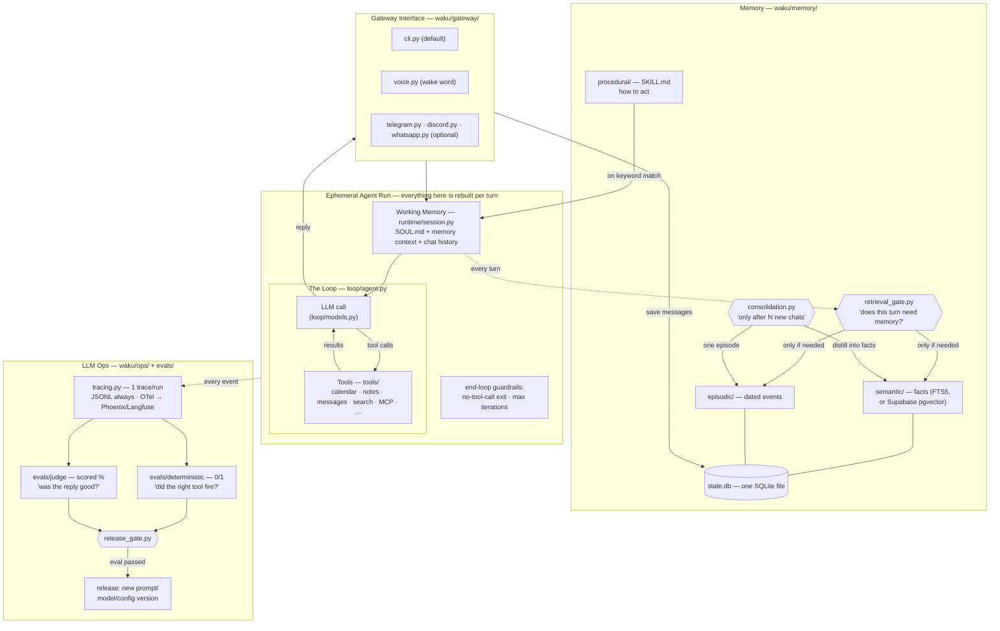
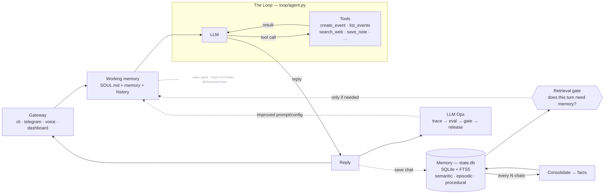

# Architecture — the whiteboard, refreshed

The same system as the two whiteboard diagrams from the previous videos
(the generic Harness/Loop/Memory/LLM-Ops one and the Hermes-specific one),
now with a file path on every box.

## The short version

> _Architecture of **waku-agent** — built on the series
> ([@ShenSeanChen](https://github.com/ShenSeanChen)). Code is MIT; **this diagram is licensed CC BY-NC-SA 4.0** —
> reuse it with credit to the channel, not for commercial resale._

### MEMORY.md vs state.db

Some assistants (e.g. Hermes) keep long-term memory as a single `MEMORY.md`
markdown file. By default, Waku keeps the *queryable* source in `state.db` (the `facts` and
`episodes` tables, keyword-searchable via FTS5) **and** regenerates a readable
`.waku/MEMORY.md` mirror after every turn — so you get both: a real file you
can open, backed by a sturdy database. The dashboard's **Memory** tab is the
friendly view; the **Data** tab shows the raw `state.db` tables.

When a remote adapter is selected, that store is authoritative for its memories.
The readable mirror and Memory tab use the selected stores, rather than showing
unrelated local fact rows.

## Which file is which

- `waku/gateway/` — how text gets in and out: `cli.py`, `voice.py` (wake word),
  `telegram.py`, `discord.py` and `whatsapp.py`, started by `runner.py` and
  `supervisor.py`. Gateways only move text.
- `waku/runtime/session.py` assembles SOUL.md, memory context and chat history.
  `runtime/context.py` budgets each request; `runtime/records.py` preserves original
  messages and tool results while the prompt uses bounded observations.
- `waku/loop/agent.py` — the loop. `loop/models.py` — pluggable providers over
  two wire formats.
- `waku/graph/` — the engine, node factories and `workflows/` (triage): opt-in
  structure around the loop. The loop never changes, a graph node can be a loop
  turn. Terminal budget/recording failures and failures after tool execution stop
  the turn; they never fall back to replaying the action.
- `waku/tools/` — what the agent can call: `calendar.py`, `google_calendar.py`,
  `apple.py`, `notes.py`, `messages.py`, `search.py`, `github.py`,
  `workspace.py`, `memory_admin.py`, the MCP client and `experimental.py`.
  `registry.py` decides which are on.
- `waku/memory/` — semantic (FTS5), episodic and procedural (SKILL.md) memory,
  plus `retrieval_gate.py` (hero 1: does this turn need memory?) and
  `consolidation.py` (legacy extraction), `batches.py` (bounded lifecycle extraction)
  and `lifecycle.py` (scope, deduplication, versions and suppression).
- `waku/ops/` — tracing (JSONL + OTel), the dashboard (localhost:7777),
  `release_gate.py`, and `compare_history.py` (the Compare arena's own JSONL
  scoreboard, never `state.db`).
- `waku/ops/static/` — the dashboard frontend. Read
  [context/design-system.md](context/design-system.md) before changing how
  anything looks.
- `evals/deterministic/` (0/1, pytest) and `evals/judge/` (DeepEval, scored).
  The two never mix.
- `examples/` — teaching material, not product; one folder per topic.
- `.waku/` — runtime state: `state.db`, `calendar.ics`, `outbox/`, `traces/`.
  Gitignored.

## Design decisions worth stealing

- **The gate before retrieval** (not retrieval on every turn): a cheap-model judge
  answers "does this message need the user's memory?" — saves latency and, more
  importantly, keeps irrelevant memories from biasing answers.
- **Consolidation is batched** ("after N chats") and runs after the loop produces
  a reply, before the turn returns. If extraction fails, its sources stay pending.
- **Deterministic evals and judge evals never mix.** One is a unit test, the other
  is a scored opinion. The release gate requires 100% of the first and a threshold
  on the second.
- **Every layer has a boring default and a documented upgrade** — FTS5 → pgvector,
  mock calendar → Google Calendar, JSONL → Phoenix/Langfuse. The default is always
  zero-signup.
- **Graphs wrap the loop, never replace it.** When a turn needs shape (parallel
  steps, explicit routing), an opt-in graph workflow (`waku/graph/`) arranges nodes
  around the untouched loop — the `full_agent` node IS `run_loop`. Routers are plain
  code reading state a model wrote; pre-action failures can fall back to the plain loop; the
  dashboard renders the topology from the engine's own `describe()` so the picture
  can't drift. See `docs/agent-graphs-design.md`.

## Context budgets and retained results (V1)

V1 defaults to the `budget` context policy. It counts the entire serialized request,
reserves output tokens and a safety margin, then removes whole oldest exchanges
until the active turn fits. Instructions and the active tool-call/result groups
remain intact. A request that still cannot fit returns an explicit size error.
The UTF-8 byte estimator is conservative, not an exact tokenizer. Provider usage
can increase future estimates; missing usage cannot reduce them. Explicit model
capacities override a 32,768-token fallback policy, which is not a provider guarantee.

The shared Waku client guards loop, streaming, quick-reply, retrieval and
consolidation calls. Graph LLM nodes and standalone loops also guard requests.
Oversized helper requests fail before dispatch; a consolidation backlog stays
unprocessed when its request is too large. The V3 lifecycle policy uses bounded
session batches; a single oversized exchange remains pending.

Additive `session_messages` and `tool_executions` tables preserve original content
and call IDs alongside the compatible chat log. A tool execution is committed as
pending before it runs; completion stores its full result under `results/<id>.txt`.
Pending after interruption means unknown outcome, not safe to retry. Result files
are private runtime data. `manage_memory read_result` reads bounded UTF-8 pages by
result ID in the current session, without accepting arbitrary paths.

Large observations retain execution state, quoted outcome fields, head/tail excerpts
and a result reference. Reported text does not prove external action success. Recent
prompt history keeps these bounded observations; canonical records retain originals.
V1 does not summarize history, remove raw data or guarantee exactly-once external actions.

## Session checkpoints (V2)

The opt-in `compact` policy replaces history eviction with a persisted task
checkpoint. `runtime/checkpoints.py` groups canonical messages by turn and
publishes a summary, source boundary and revision together. Concurrent or
invalid replacements leave the previous revision intact. Original records and
tool result files stay unchanged. Text-only legacy sessions are imported with
their original chat-log row references; no tool identifiers are invented.
Sessions mixing unlinked legacy exchanges with structured turns require a new
compact session or the budget policy; V2 does not guess how to merge them.

`runtime/compaction.py` summarizes older turns in bounded batches using the
main model, or a configured model on the same provider. Six structured fields
hold goals, constraints, completed work, decisions, unresolved work and next
steps. Each entry cites source message IDs. Large tool results retain bounded
previews and saved-result references. Source hashes and per-call usage describe
what each revision covered. Schema validation checks provenance, not semantic
truth; real-model retention still needs quality evaluation.

The request assembler reloads the checkpoint and remaining message groups from
SQLite. It reads current rules again after compaction. Provider context errors
allow one retry of a smaller model request, while the active tool sequence stays
intact. Unknown execution outcomes stop the session with a reconciliation
message. An oversized active turn or execution ledger may still exhaust the
budget; V2 stops explicitly instead of repeating actions or discarding records.

`/compact` uses the existing CLI, gateway and dashboard entry points. It does
not add a conversation turn. The dashboard and gateway worker keep their
existing serialization. Compaction events record starts, calls, completions and
failures; missing provider usage stays unmeasured.

## Memory lifecycle (V3)

The opt-in V3 memory lifecycle is described in [v3-baseline.md](v3-baseline.md).
It links explicit corrections, deduplicates exact values, publishes bounded
SQLite extraction batches atomically and excludes invalid sources from model
context. Suppression invalidates earlier checkpoints while preserving archives
and execution receipts. The default remains the legacy write policy.

## What this deliberately is not

Not a framework, not multi-agent, not production. (Still not multi-agent even with
graph workflows: a graph's `agent_node` is the same loop invoked as one step — no
peer-to-peer agent messaging, execution follows the edges deterministically.) It's
the readable blueprint — OpenClaw and Hermes are the products; this is the afternoon
read that explains them.
